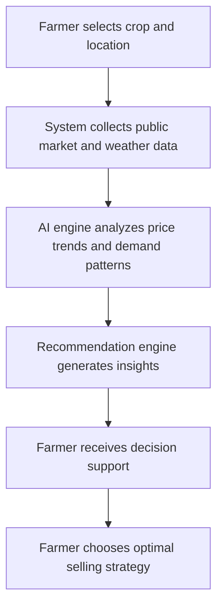
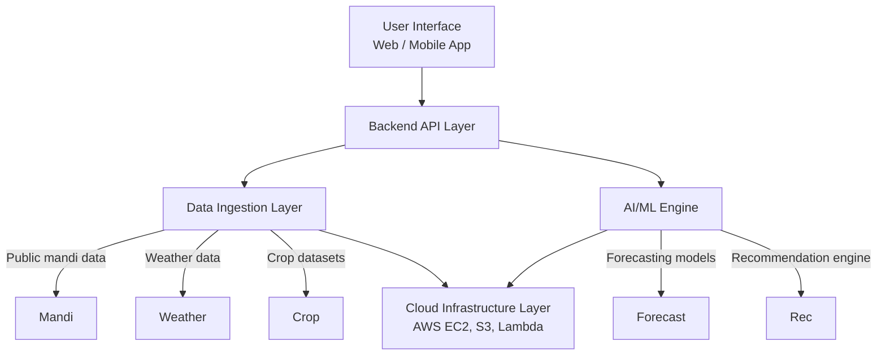

# gramsense-ai-prototype
# GramSense AI – Rural Market Intelligence & Decision Support Platform

GramSense AI is an AI-powered rural market intelligence platform designed to help small and marginal farmers make data-driven selling and crop planning decisions.

This prototype is being developed as part of the **AI for Bharat Hackathon – Prototype Phase**.

---

## 🚜 Problem Statement

Small and marginal farmers often lack access to real-time market intelligence, price forecasting, and decision support. This results in:

- Dependency on middlemen  
- Poor selling timing decisions  
- Post-harvest losses  
- Reduced income  

GramSense AI aims to provide explainable, AI-driven recommendations using publicly available agricultural data.

---

## 🧠 What This Prototype Demonstrates

The MVP includes:

- 📊 **Real-time and historical mandi price dashboard** with trend analysis
- 📈 **7–30 day AI-based price forecasting** with confidence indicators
- 💡 **Explainable selling recommendations** (Sell Now / Wait / Monitor / Change Market) with weather integration
- 🌦 **Weather-aware advisory logic** affecting price predictions and recommendations
- 📍 **Regional demand insights** with market suggestions
- 🤖 **AI query assistant** for natural language farmer queries
- 📱 **Mobile-optimized web interface** with responsive design
- ☁️ **RESTful API architecture** ready for cloud deployment  

---

## 🔎 How It Differs from Existing Solutions

1. **Decision‑intelligence focus** – not just data display; AI synthesises inputs into guidance.  
2. **Multi‑source fusion** – market + weather + seasonal trends for richer context.  
3. **Rural‑first UX** – designed for users with low digital literacy and basic devices.  
4. **Explainable AI** – recommendations come with reasoning, confidence and disclaimers.

## ✅ Solving the Problem

- Provides real-time and historical market price insights.  
- Forecasts price trends using AI models.  
- Recommends optimal selling time and locations.  
- Supports better crop planning decisions.

## 🌟 Unique Selling Propositions

- Rural-first AI design.  
- Market forecasting using public data.  
- Explainable and transparent recommendations.  
- Scalable across regions and crops.

## 🛠 Features Offered by the Solution

1. ✅ **Live mandi price aggregation** (synthetic data sources)
2. ✅ **Historical price analysis** (7-30 days of price history)
3. ✅ **AI-based price forecasting** (7-30 day predictions with confidence)
4. ✅ **Weather-aware recommendations** (integrated weather impact analysis)
5. ✅ **Regional demand insights** (demand levels by region and crop)
6. ✅ **AI query assistant for farmers** (natural language queries)
7. ✅ **Simple dashboards and visual analytics** (web-based interface)
8. ✅ **Mobile-friendly access** (responsive design)

## 📈 Process Flow Diagram



## 🏗 Architecture Overview



High-Level Flow:

User → Web Interface → Backend API →  
Data Storage (S3/DynamoDB) →  
Forecasting Model →  
Recommendation Engine →  
Bedrock (Explainable Output) → User

---

## ☁️ AWS Services Used

- **Amazon S3** – Raw dataset storage  
- **Amazon DynamoDB** – Structured price and forecast storage  
- **AWS Lambda** – Data ingestion and preprocessing  
- **Amazon SageMaker** – Forecast model execution  
- **Amazon Bedrock (Titan Text)** – Generate simplified explanations  
- **Amazon EC2** – Backend API hosting  
- **CloudWatch** – Monitoring & logs  

---

## � Getting Started

### Prerequisites
- Python 3.8+
- pip

### Installation

1. Clone the repository:
   ```bash
   git clone https://github.com/Tenali-Radhika/gramsense-ai-prototype.git
   cd gramsense-ai-prototype
   ```

2. Set up virtual environment:
   ```bash
   python -m venv .venv
   source .venv/bin/activate  # On Windows: .venv\Scripts\activate
   ```

3. Install dependencies:
   ```bash
   pip install -r backend/requirements.txt
   pip install pytest  # For testing
   ```

4. Run the backend:
   ```bash
   python -m uvicorn backend.main:app --reload --host 0.0.0.0 --port 8000
   ```

5. Open the frontend:
   - Open `frontend/index.html` in your browser
   - Or serve it with a simple HTTP server:
     ```bash
     cd frontend
     python -m http.server 3000
     ```
   - Then visit `http://localhost:3000`

### API Endpoints

- `GET /` - Root endpoint
- `GET /health` - Health check
- `GET /prices?crop={crop}&lat={lat}&lon={lon}&days={days}` - Get mandi prices (current or historical)
- `GET /forecast?crop={crop}&lat={lat}&lon={lon}&horizon={days}` - Get price forecast
- `GET /recommendation?crop={crop}&lat={lat}&lon={lon}&quantity={qty}` - Get selling recommendation
- `GET /optimal_markets?crop={crop}&lat={lat}&lon={lon}` - Get optimal market suggestions
- `GET /crop_advice?lat={lat}&lon={lon}&season={season}` - Get crop planning advice
- `GET /regional_demand?crop={crop}&lat={lat}&lon={lon}` - Get regional demand insights
- `POST /query_assistant` - AI query assistant for farmers

### Running Tests

```bash
python -m pytest backend/tests/ -v
```

## ☁️ AWS Deployment Guide

### Prerequisites for AWS Deployment

1. **AWS Account** with credits (you have $100+ available)
2. **AWS CLI** installed and configured
3. **SSH Key Pair** for EC2 access

### AWS Credentials Setup

1. **Get your AWS credentials:**
   - Go to AWS Console → IAM → Users → Your User → Security credentials
   - Create Access Key (if you don't have one)
   - Note down: `AWS_ACCESS_KEY_ID` and `AWS_SECRET_ACCESS_KEY`

2. **Configure AWS CLI:**
   ```bash
   aws configure
   # Enter your Access Key ID, Secret Access Key, default region (us-east-1), and output format (json)
   ```

3. **Set environment variables (optional):**
   ```bash
   export AWS_ACCESS_KEY_ID=your_key_here
   export AWS_SECRET_ACCESS_KEY=your_secret_here
   export AWS_DEFAULT_REGION=us-east-1
   ```

### Quick Deployment to AWS

1. **Make the deployment script executable:**
   ```bash
   chmod +x deploy.sh
   ```

2. **Run the deployment script:**
   ```bash
   ./deploy.sh
   ```
   - Enter your AWS region (default: us-east-1)
   - Enter EC2 instance type (default: t3.micro - Free Tier eligible)
   - Enter your SSH key pair name

3. **The script will:**
   - Create a CloudFormation template
   - Set up an EC2 instance with security groups
   - Configure nginx and systemd services
   - Deploy your application

4. **Access your deployed app:**
   - The script will output the public IP address
   - Visit: `http://your-instance-ip`
   - API: `http://your-instance-ip/api/`

### Manual EC2 Deployment

If you prefer manual setup:

1. **Launch EC2 instance:**
   - Instance type: `t3.micro` (Free Tier)
   - AMI: Amazon Linux 2
   - Security group: Allow HTTP (80) and SSH (22)

2. **Connect via SSH:**
   ```bash
   ssh -i your-key.pem ec2-user@your-instance-ip
   ```

3. **Run setup commands:**
   ```bash
   sudo yum update -y
   sudo yum install -y python3 git nginx
   git clone https://github.com/Tenali-Radhika/gramsense-ai-prototype.git
   cd gramsense-ai-prototype
   python3 -m venv venv
   source venv/bin/activate
   pip install -r backend/requirements.txt
   ```

4. **Configure services:**
   - Copy the systemd service from `deploy.sh`
   - Configure nginx as shown in the deployment script
   - Start services

### Cost Management

- **Free Tier Limits:** Monitor usage in AWS Console → Billing
- **Set Budget Alerts:** $10/month warning as safety buffer
- **Stop Instances:** When not in use to avoid charges
- **Use CloudWatch:** Set alarms for EC2 usage

### Troubleshooting AWS Deployment

- **Permission Denied:** Check IAM permissions for EC2, CloudFormation
- **Key Pair Issues:** Ensure key pair exists in your AWS region
- **Connection Timeout:** Check security groups allow SSH/HTTP
- **Service Failures:** Check CloudWatch logs in EC2 instance

## 📋 Manual Setup Guide

### Prerequisites
- Python 3.8+ installed
- Git for cloning repository
- Web browser for frontend access

### Step-by-Step Setup

1. **Clone the Repository**
   ```bash
   git clone https://github.com/Tenali-Radhika/gramsense-ai-prototype.git
   cd gramsense-ai-prototype
   ```

2. **Create Virtual Environment**
   ```bash
   python -m venv .venv
   source .venv/bin/activate  # Linux/Mac
   # OR
   .venv\Scripts\activate     # Windows
   ```

3. **Install Dependencies**
   ```bash
   pip install -r backend/requirements.txt
   pip install pytest  # For running tests
   ```

4. **Verify Installation**
   ```bash
   python -c "import fastapi, uvicorn; print('Dependencies installed successfully')"
   ```

5. **Run Tests (Optional but Recommended)**
   ```bash
   python -m pytest backend/tests/ -v
   ```

6. **Start Backend Server**
   ```bash
   python -m uvicorn backend.main:app --reload --host 0.0.0.0 --port 8000
   ```
   The API will be available at `http://localhost:8000`

7. **Access Frontend**
   - Option 1: Open `frontend/index.html` directly in browser
   - Option 2: Serve with Python HTTP server
     ```bash
     cd frontend
     python -m http.server 3000
     ```
     Then visit `http://localhost:3000`

### Manual Configuration (For Real Data Integration - Optional)

**Note:** The prototype uses synthetic data by default. For production, integrate real APIs:

#### Agmarknet Data (Indian Mandi Prices)
- **Source**: https://agmarknet.gov.in/
- **Access**: Public API available, no credentials required
- **Manual Work**: 
  - Visit the website to understand data format
  - Update `backend/data_ingestion/mandi.py` to fetch from actual API
  - Handle rate limits and data parsing

#### IMD Weather Data (India Meteorological Department)
- **Source**: https://imdpune.gov.in/
- **Access**: Public datasets, some APIs require registration
- **Manual Work**:
  - Register for API access if needed
  - Obtain API key (if required)
  - Update `backend/data_ingestion/weather.py` with real endpoints
  - Store API key securely (environment variables)

#### Environment Variables Setup
Create a `.env` file in the backend directory:
```bash
# For future real API integrations
AGMARKNET_API_KEY=your_key_here
IMD_API_KEY=your_key_here
OPENWEATHER_API_KEY=your_key_here  # Alternative weather API
```

#### Database Setup (For Production)
- **AWS DynamoDB**: Create tables for prices, forecasts, users
- **Manual Work**:
  - Set up AWS account
  - Create DynamoDB tables
  - Configure IAM roles
  - Update connection strings in code

### Troubleshooting

**Common Issues:**
- **Port 8000 already in use**: Change port with `--port 8001`
- **Import errors**: Ensure virtual environment is activated
- **Frontend not loading**: Check CORS settings in browser
- **Tests failing**: Ensure all dependencies are installed

**API Testing:**
```bash
curl "http://localhost:8000/prices?crop=wheat&lat=28.6139&lon=77.2090"
curl "http://localhost:8000/health"
```

## 📂 Repository Structure
```
gramsense-ai-prototype/
│
├── README.md
├── backend/
│   ├── __init__.py
│   ├── main.py
│   ├── models.py
│   ├── requirements.txt
│   ├── api/
│   │   ├── __init__.py
│   │   ├── forecast.py
│   │   ├── prices.py
│   │   └── recommendation.py
│   ├── data_ingestion/
│   │   ├── __init__.py
│   │   ├── crop_calendar.py
│   │   ├── mandi.py
│   │   └── weather.py
│   ├── forecasting/
│   │   ├── __init__.py
│   │   └── engine.py
│   ├── recommendation/
│   │   ├── __init__.py
│   │   └── engine.py
│   └── tests/
│       ├── test_api.py
│       ├── test_data_ingestion.py
│       ├── test_forecasting.py
│       └── test_recommendation.py
└── frontend/
    └── index.html
```

---

## 📊 Data Strategy

### Data Sources
- Agmarknet mandi price datasets
- India Meteorological Department (IMD) weather data
- Public crop calendar datasets

### Data Handling
- Raw data stored in S3
- Processed data stored in DynamoDB
- Forecasting executed via SageMaker
- No personal financial data collected
- Advisory-only AI outputs

---

## 🧪 AI Components

### 1️⃣ Price Forecasting
- Time-series forecasting (Prophet/ARIMA)
- 7–14 day predictions
- Confidence indicators

### 2️⃣ Recommendation Engine
- Combines:
  - Price trend
  - Weather signals
  - Seasonal demand
- Outputs:
  - SELL_NOW
  - WAIT
  - CONSIDER_ALTERNATE_MARKET

### 3️⃣ Explainable AI Layer
- Amazon Bedrock (Titan Text)
- Converts structured model outputs into simple advisory language
- Includes confidence and disclaimers

---

## ⚠ Responsible AI Commitments

- Only publicly available datasets
- No personal or financial data
- All recommendations include confidence levels
- Advisory system — not a financial guarantee
- Transparent data sourcing

---

## 🚀 7-Day Prototype Roadmap

Day 1–2: Backend setup and data ingestion  
Day 3–4: Forecast model integration  
Day 5: Recommendation logic  
Day 6: AWS deployment  
Day 7: Demo recording and submission  

---

## 🛠 Local Development Setup

### Backend

```bash
cd backend
pip install -r requirements.txt
uvicorn main:app --reload
```

Once the server is running, you can exercise the new API endpoints:

```bash
# health check
curl http://127.0.0.1:8000/health

# fetch prices
curl "http://127.0.0.1:8000/prices?crop=wheat&lat=26.9&lon=80.9"

# get forecast
curl "http://127.0.0.1:8000/forecast?crop=wheat&lat=26.9&lon=80.9"

# request a recommendation
curl "http://127.0.0.1:8000/recommendation?crop=wheat&lat=26.9&lon=80.9&quantity=100"
```

### Frontend

```bash
cd frontend
npm install
npm start
```