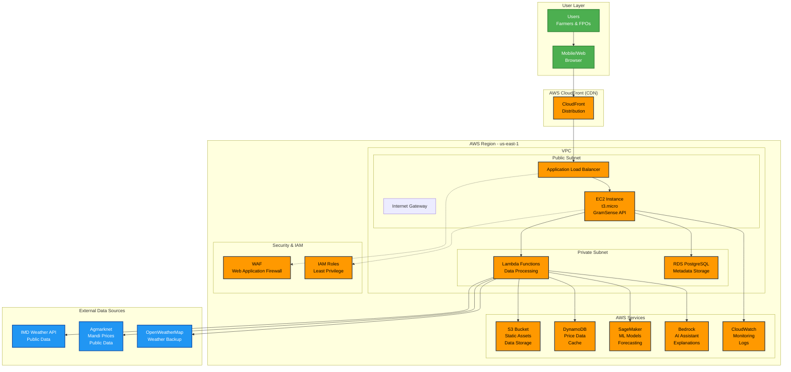

# GramSense AI - AWS Architecture Diagram

## Architecture Explanation

### Components

1. **User Layer**
   - Farmers and FPOs access via web/mobile browsers
   - Responsive design optimized for rural connectivity

2. **Edge Layer**
   - CloudFront CDN for global content delivery
   - Reduces latency for users across India

3. **Compute Layer**
   - EC2 instance (t3.micro) for main application
   - Lambda functions for serverless data processing
   - Auto-scaling based on demand

4. **Data Layer**
   - DynamoDB for fast price data access
   - RDS for relational metadata
   - S3 for static assets and bulk data

5. **AI/ML Layer**
   - SageMaker for forecasting models
   - Amazon Bedrock for explainable AI responses

6. **Security Layer**
   - WAF for application protection
   - IAM with least privilege access
   - VPC isolation

### Data Flow

1. User requests → CloudFront → ALB → EC2
2. EC2 processes request, calls Lambda for data processing
3. Lambda fetches data from DynamoDB/S3 or external APIs
4. AI processing via SageMaker/Bedrock
5. Results cached and returned to user

### Cost Optimization

- **Free Tier Utilization**: t3.micro (750 hours/month), Lambda free tier
- **Reserved Instances**: For production scaling
- **S3 Storage Classes**: Intelligent tiering
- **CloudWatch**: Basic monitoring included

### Scalability

- **Horizontal Scaling**: EC2 auto-scaling groups
- **Serverless**: Lambda for variable workloads
- **Global**: CloudFront for worldwide access
- **Data**: DynamoDB on-demand scaling

### Security Measures

- **Network**: VPC with public/private subnets
- **Access**: IAM roles, no direct credentials
- **Data**: Encryption at rest and in transit
- **Monitoring**: CloudWatch alerts for anomalies

### Deployment

- **Infrastructure as Code**: CloudFormation templates
- **CI/CD**: GitHub Actions for automated deployment
- **Monitoring**: CloudWatch dashboards
- **Backup**: S3 versioning and cross-region replication